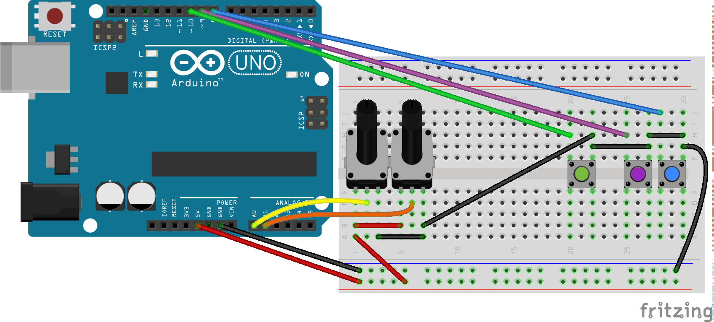

# Arduino MIDI Controller

Plan:
- [x] Code it
    - [x] Potentiometers
    - [x] Buttons
    - [x] Faders
    - [x] Write the efficient code for more sensors
        - [x] for pots
        - [x] for buttons
    - [x] Add the command switch
        - [x] for pots
        - [x] for buttons
    - [x] Add the LED for the switch
    - [x] Clean the code
- [ ] Construct it
    - [ ] Design an enclosure
    - [ ] More buttons
    - [ ] More stuff
    - [ ] Wiring and soldering
- [x] circuit design w/ Fritzing
- [ ] Tutorial

First project that worked for me:
https://www.instructables.com/id/Easy-3-Pot-Potentiometer-Arduino-Uno-Effects-Midi-/

This one has buttons and fader, didn’t work for me yet:
https://www.instructables.com/id/Arduino-MIDI-Controller/

Made the CC work, had troubles with button, asked a question:
https://forum.arduino.cc/index.php?topic=628697.0

Got the hint at the forum: Pull Up Resistor: 
https://www.baldengineer.com/arduino-internal-pull-up-resistor-tutorial.html

This is a switch example I used to make the button work as I needed:
https://www.arduino.cc/en/Tutorial/Switch

