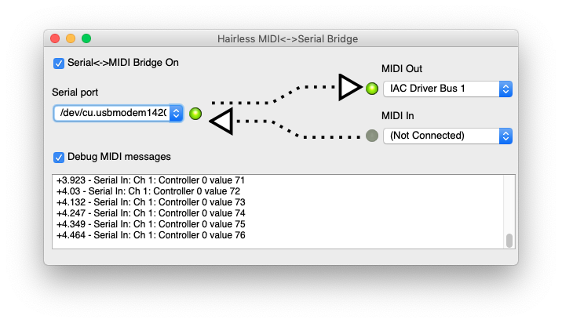

# Arduino MIDI Controller

## Description

MIDI Controller, based on Arduino Uno, no third party libraries. 
However, since Arduino Uno does not have native MIDI support, we use third party software, [Hariless MIDI](https://projectgus.github.io/hairless-midiserial/) to convert Serial to MIDI. [На русском](https://viktorgordienko.com/arduino-midi-controller)

## Scheme
Two potentiometers, two buttons as MIDI notes, the green button - control bank switch.


Customize the code:
```
int numberOfPots = 2;     //Total number of potentiometers
int numberOfButtons = 2;  //Total number of buttons
```

Serial to MIDI convertion:


## Plan
- [x] Code it
    - [x] Potentiometers
    - [x] Buttons
    - [x] Faders
    - [x] Write the efficient code for more sensors
        - [x] for pots
        - [x] for buttons
    - [x] Add the command switch
        - [x] for pots
        - [x] for buttons
    - [x] Add the LED for the switch
    - [x] Clean the code
- [x] Construct it
    - [x] Design an enclosure
    - [x] More buttons
    - [x] More stuff
    - [x] Wiring and soldering
- [x] circuit design w/ Fritzing
- [x] Tutorial

Sep 02 2019 - Finished the demo project.

## Update
- [ ] White LED to indicate power on
- [ ] Two green LEDs on each side to indicate the switch (one is on, one is off)
    - [ ] Or! Code an option to add another switch to make all the buttons and pots have 3 modes instead of two
- [ ] Replace Uno with Mega for more analog inputs (no multiplexers this time)
- [ ] Add two buttons
- [ ] Make the wires going to the board much longer
- [ ] Connect the remaining pots
- [ ] Reconnect faders (switch ground and power to reverse the fader)

## Useful stuff

- First project that worked for me:
https://www.instructables.com/id/Easy-3-Pot-Potentiometer-Arduino-Uno-Effects-Midi-/
- This one has buttons and fader, didn’t work for me yet:
https://www.instructables.com/id/Arduino-MIDI-Controller/
- Made the CC work, had troubles with buttons, asked a question:
https://forum.arduino.cc/index.php?topic=628697.0
- Got the hint at the forum: Pull Up Resistor: 
https://www.baldengineer.com/arduino-internal-pull-up-resistor-tutorial.html
- This is a switch example I used to make the button work as I needed:
https://www.arduino.cc/en/Tutorial/Switch

